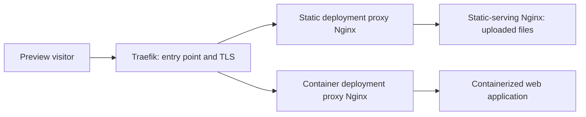

# First deployment feature

senv means simple environment. It is a deployment and preview application for trusted teams running a self-hosted instance. This specification records the agreed first-feature behavior and the remaining implementation details.

The [glossary](../CONTEXT.md) defines the domain language. Architecture records cover [routing](adr/0001-deployment-routing.md), [first-feature scope](adr/0002-prebuilt-stateless-deployments.md), [project slug changes](adr/0003-editable-preview-project-slugs.md), and [deployment snapshots](adr/0004-fixed-deployments-and-movable-addresses.md).

## Goal and scope

Project members publish prebuilt web applications, visit individual versions, and select versions through branch aliases or manually assigned senv tags. Preview URLs are public. Project membership controls management access, not visits to deployed applications.

The first feature supports stateless web deployments, both static sites and containerized web applications. They can be short-lived or long-lived. Stateful environments containing persistent services such as databases are later scope. Lifetime and persistence are separate concepts.

Submission is through the web UI. senv does not clone repositories or build applications. CI submission APIs, automation credentials, remote Docker hosts, and a separate execution worker are later scope. This specification creates no tickets or runtime implementation.

## Current project

Accounts, instance administration, projects, memberships, and invitations already exist. Projects have viewer, developer, and admin roles, and instance admins can manage projects without membership. Developers and viewers currently have the same read permissions; deployment operations will distinguish them.

The Deployments section at `/projects/:projectId/deployments` is an empty state. There is no deployment schema, deployment API, artifact management, orchestration, or preview routing yet. Production Compose runs the senv app, API, and migration service. Its SQLite storage is senv infrastructure, not a user-deployed stateful environment.

The existing internal project slug equals the immutable project ID. The readable preview slug described below is a separate concept.

The starter database can be reset when introducing the feature's schema. There is no requirement to preserve starter data or backfill existing project slugs; initialize fresh data instead. This records the implementation approach for the current starter, not an instruction to reset a database during specification work.

Code references:

- [Project identity and internal slug rules](../apps/api/server/utils/project-options.ts)
- [Existing project roles](../apps/api/shared/project-permissions.ts)
- [Project access checks](../apps/api/server/trpc/routers/projects.router.ts)
- [Database schema](../drizzle/schema.ts)
- [Deployments empty state](../apps/app/src/app/pages/projects/project-page/project-page.page.ts)
- [Production Compose file](../compose.prod.yml)

## Project settings and permissions

A project has no repository or one repository. Optional commit and branch metadata refer to that repository when present. senv accepts the publisher's source association as information; it does not verify that an externally built artifact corresponds to a commit. There are no separate application or repository branch namespaces within a project.

| Capability | Viewer | Developer | Project admin |
| --- | --- | --- | --- |
| Read status, logs, and non-secret configuration | Yes | Yes | Yes |
| Publish, stop, restart, or delete deployments | No | Yes | Yes |
| Assign, move, or remove deployment tags | No | Yes | Yes |
| Manage project registry credentials and deployment secrets | No | Yes | Yes |
| Edit project reverse-proxy, compression, and cache defaults | No | Yes | Yes |
| Edit project health-check defaults | No | Yes | Yes |
| Edit project CPU and memory defaults or retention | No | No | Yes |
| Manage membership, project name, or preview slug | No | No | Yes |
| Permanently remove retained deployment history | No | No | Yes |

Instance admins retain authority over all projects. They also control the static upload-size limit, proxy resource allowance, and log-size defaults. There is no instance-wide proxy-policy editor; proxy, compression, and cache settings belong to projects.

Project proxy settings use a form rather than a raw Nginx-template editor. Validate changes before saving new defaults; invalid changes retain the last valid defaults and report the error. Valid changes affect future deployments only.

The form supports multiple reverse-proxy routes with path rewrites, proxy timeouts, and multiple cache rules matching file types or paths with configurable cache duration. Caching is off by default. Compression is on by default and applies to all file endings, with configurable allowed endings. An explicit proxy route overrides the default origin for matching paths; unmatched paths retain the default origin.

CPU and memory defaults limit each deployment's origin independently, not a pooled project budget. Start at 1 CPU and 512 MiB for the application or static-origin container. Project admins control the origin defaults. The separate proxy allowance defaults to 0.1 CPU and 64 MiB and is controlled by instance admins. New deployments capture both allowances; existing deployments retain their captured limits.

Private-registry credentials are reusable project-scoped records, selectable during publication and managed by developers or admins. Public registries require no credentials. Stored secret values are hidden after entry. Replacing runtime secrets requires a new deployment. Application logs may contain values printed by the application, so hiding secret configuration does not promise that logs contain no secrets.

## Publication and configuration snapshots

Each publish creates a new deployment identity, even for the same commit or artifact. Its content and runtime configuration are fixed:

- Static artifact bytes, or the container image resolved to a digest.
- Environment variables and secrets.
- HTTP port and health-check configuration captured from project health settings.
- Static SPA behavior.
- Origin CPU and memory limits captured from project defaults, plus the proxy's separate allowance.
- Reverse-proxy, compression, and cache settings captured from project defaults.

Changing any of these requires a new deployment. Project-default changes do not update existing deployments. Versions of the same project can therefore run with different captured settings.

A developer or admin can publish a replacement using an existing deployment's retained fixed artifact without uploading those files or selecting new image content again. The replacement gets a new identity and captures the chosen runtime settings and current project defaults. Reusing content does not couple deployment lifecycles: deleting or cleaning up one deployment must not remove content still required by another retained deployment.

Tags, branch selection, and intended running or stopped state can change without changing deployment identity. Restarting a stopped deployment uses its existing artifact and configuration snapshot. Once cleanup or deletion removes its artifact, it cannot restart; a new publication must supply the artifact again and gets a new identity.

### Static input

Accept an uploaded directory or ZIP. The directory's contents or ZIP root is the website root, and `index.html` is required there. Selecting a nested website root, such as `dist/browser`, is outside the first feature.

The upload-size limit defaults to 100 MiB. Instance admins configure it. Enforce it on both uploaded bytes and the total extracted website size; directory uploads use the same total-size limit.

SPA fallback to `index.html` is configurable. Ordinary file serving remains available.

### Container input

Accept an existing registry image containing a web application. Resolve its reference to a digest at publication so restarting the deployment cannot silently pull different content.

Configure its HTTP port and environment values or secrets. Capture its HTTP health check from project settings. Use the image's startup command; command overrides are later scope. Workload volumes and privileged settings are excluded.

Support WebSockets and streaming responses. Applications may connect to externally managed services, including databases, but senv does not provision those services or manage their data. Files written inside an application container carry no senv-managed persistence guarantee.

## Hosting and routing

The API directly controls one local Docker host. The operator supplies the configurable preview base domain, DNS, and TLS setup.

Every deployment has two containers: a proxy Nginx and an origin. Static deployments use a separate static-serving Nginx as the origin, with their uploaded files mounted. Container deployments use the application container as the origin.

The proxy handles reverse proxying, compression, and caching using the deployment's captured project settings. Traefik sits ahead of all deployment proxies and handles TLS. Moving a branch alias or deployment tag must not serve cached content from its former target.

Additional proxy routes can target configured reachable HTTP(S) URLs or host:port destinations, including services reachable from the deployment network. senv does not provision those services. A route may rewrite the path, for example sending `/api/users` to `/users` at an external API. Explicit matching routes take precedence over the default deployment origin; they do not change unmatched paths.

### Proxy and cache rule precedence

Explicit proxy routes always bypass caching, including requests that also match a file-type or path cache rule. For example, `/api/app.js` follows the `/api` proxy route without being cached by a `.js` cache rule.

Among matching proxy routes, use the most specific path. `/api/admin` takes precedence over `/api`. For paths not claimed by a proxy route, use the most specific matching path cache rule; file-type cache rules apply only if no path cache rule matches. Reject duplicate or equally specific conflicting rules during validation.

For cache-eligible default-origin requests, preserve upstream `private` and `no-store` restrictions, bypass authenticated or cookie-bearing requests, and do not cache responses that set cookies. Cache isolation must preserve the identity of the selected deployment when aliases move.

## Addresses and selections

| Address | Meaning |
| --- | --- |
| `dpl-<nanoid>.<project-slug>.<preview-domain>` | One deployment identity. |
| `br-<branch-name>.<project-slug>.<preview-domain>` | The deployment selected for a branch. |
| `<tag>.<project-slug>.<preview-domain>` | The deployment manually selected by a senv tag. |

The local preview-domain example is `preview.localhost`. The preview slug is readable and editable, separate from the project's identity and display name. At project creation, suggest a slug from the name and let the creator edit it. Require uniqueness within the instance, lowercase letters and digits, and hyphens only within the label. The starter database reset removes the need to assign slugs to existing projects.

Changing the slug retires all old deployment, branch, and tag URLs immediately and allows another project to reuse the old slug. Previously shared links can therefore later point to a different project.

Simple branch names retain readable aliases, such as `br-main`. Names requiring normalization use a readable prefix plus an eight-character hash of the original case-sensitive branch name, extending the suffix if a collision occurs. This keeps `feature/login`, `feature-login`, and `Feature/Login` distinct. Shorten the readable portion when necessary to fit the hostname label; retain each assigned alias across restarts.

Deployment tag names are lowercase DNS-safe labels. Reserve the `br-` and `dpl-` prefixes to avoid collisions within a project's hostname namespace.

### Branch selection

Supplying branch metadata associates a deployment with that branch. When a newer submission becomes healthy, it takes over the branch alias. Submission order determines which successful deployment is newer. An older submission completing later cannot replace a newer selected target. A failed replacement leaves the current target selected.

Older deployments keep their individual URLs and branch association until cleanup. If a selected target later becomes unhealthy, keep the selection and show its unhealthy status rather than automatically rolling back.

### Deployment tags

Tags are manual senv labels assigned to existing deployments in the UI. They have no Git integration and are independent of registry image tags. `latest` and `main` are example label names, with no special newest-release or default-branch behavior.

Each tag selects one deployment within its project. A deployment can have several tags. Developers and admins can assign, move, or remove them. Assigning or moving a tag requires a currently healthy target. Removing a tag retires that named URL; moving it selects the new target. A target becoming unhealthy later does not remove its tags.

## Readiness, stopping, and recovery

Health checks are configured in project settings, not per deployment, and captured at publication. The HTTP path defaults to `/`, startup deadline to 60 seconds, polling interval to five seconds, and per-probe timeout to three seconds. The first 2xx response marks readiness. After readiness, three consecutive failed probes mark the deployment unhealthy and one successful probe restores healthy status. Neither event moves branch or tag selections.

Check the owned origin and proxy rather than accepting a cached response or a response from an external proxy route as proof of readiness. For static deployments, validate the required root `index.html` and verify that the static-serving origin responds successfully. The owned proxy must also be running with valid configuration before the deployment becomes ready.

Manual stopping preserves the deployment's identity, retained artifact, branch selections, and tags, but makes its URLs unavailable. Developers and admins can restart it with the same snapshot and identity. Readiness gates its return to service. Manual deletion removes its containers, artifact, individual URL, and attached branch or tag selections. Neither operation automatically selects an older deployment.

After an API or Docker restart, senv reconciles deployment records with its own containers, restores deployments intended to run, and leaves explicitly stopped deployments stopped. Failed restoration must be visible rather than silently selecting another version.

## Retention and history

Retention is a project setting controlled by admins, defaulting to seven days. A deployment is protected from timed cleanup while selected by any branch or carrying any deployment tag. Protection remains if the selected deployment becomes unhealthy or is deliberately stopped. Protection does not prevent manual deletion.

| Event | Retention behavior |
| --- | --- |
| An untagged branch deployment is superseded and loses its final protection | Start a fresh retention period at supersession. |
| A deployment loses its final tag and is not selected by a branch | Start a fresh retention period, regardless of its age. |
| Another branch or tag still selects the deployment | Keep protection; do not start cleanup merely because one selection changed. |
| An unprotected deployment becomes ready but is never selected, including a standalone deployment | Start its clock at readiness. |
| A deployment fails before readiness | Start its unprotected clock at failure. |
| An unprotected deployment is stopped | Stopping alone grants no protection and does not reset an existing clock. |
| A project admin changes retention | Recalculate existing deadlines from their recorded clock starts. Shortening the period can make cleanup immediately due. |
| An unprotected deployment reaches its deadline | Remove its containers and stored artifact, but keep its history record. |

Manual deletion also preserves deployment history. Only project admins can permanently remove retained history records; instance admins retain their project-wide authority. Cleaned-up or deleted deployments cannot restart because their artifacts are no longer retained for them.

## Logs and diagnostic history

Expose bounded logs from both the proxy and origin while the deployment is retained. Default to three rotated files of 10 MiB per container. Instance admins control the log-size defaults.

On manual deletion or timed cleanup, remove raw deployment logs and deployment runtime secret values. Keep lifecycle events, source metadata, configuration summaries without secret values, and failure reasons in the deployment history record. Project-scoped registry credentials have their own lifecycle; removing a deployment does not remove credentials used by other deployments.

## Implementation details still to specify

These do not reopen the agreed product boundaries:

- Exact slug normalization and hash algorithm, hostname length validation, collision handling, and switching active routes when a preview slug changes.
- Precise path/file-type matcher syntax, path-rewrite representation, proxy-timeout defaults, cache-duration defaults, and compression matching for extensionless responses.
- Detailed progress and error states, health-failure reporting, partial-upload handling, reconciliation of incomplete resources, and unavailable-registry errors.
- Artifact storage and lifecycle handling when deployments reuse content.

## Technical constraints

- Localhost HTTPS needs locally trusted certificates or an explicit development HTTP policy. Let's Encrypt does not issue certificates for `localhost`. See [localhost guidance](https://letsencrypt.org/docs/certificates-for-localhost/).
- A TLS wildcard covers one hostname label. `*.preview.example.com` does not cover `dpl-id.project.preview.example.com`; use per-project wildcard coverage or individual hostname certificates. See [RFC 9525, section 6.3](https://www.rfc-editor.org/rfc/rfc9525.html#section-6.3).
- Traefik's ACME wildcard issuance requires a DNS challenge, which affects operator DNS credentials. See [Traefik ACME documentation](https://doc.traefik.io/traefik/reference/install-configuration/tls/certificate-resolvers/acme/).
- DNS labels have a maximum of 63 octets. Validate individual generated labels and the complete domain name when configuring the preview base domain. See [RFC 1035, section 2.3.4](https://www.rfc-editor.org/rfc/rfc1035.html#section-2.3.4).
- Nginx supports upstream cache-control headers and excludes responses with `Set-Cookie` by default. Project cache settings must account for authenticated traffic and isolation across deployments and alias changes. See [Nginx proxy cache documentation](https://nginx.org/en/docs/http/ngx_http_proxy_module.html#proxy_cache_valid).

## Later stateful environments

Keep persistent service identity and data ownership separate from web deployment replacement. A future database may survive many web publications and be reachable only within an environment's private network. The HTTP deployment routing requirement does not imply exposing databases through Nginx or Traefik.

Database provisioning, user-workload volumes, backup and restore, migrations, multi-service composition, and persistent-data lifecycle rules remain outside the first feature.
